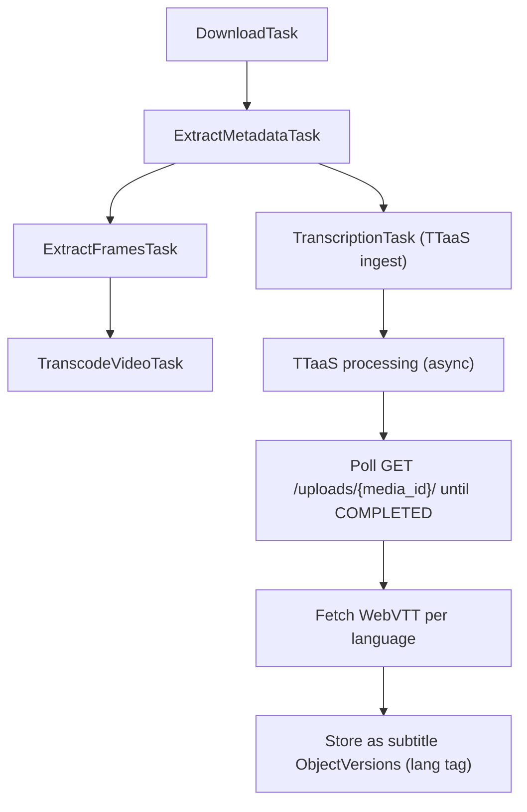

- Start Date: 2026-06-25
- RFC PR: [#XXXX](https://github.com/CERNDocumentServer/cds-videos/pull/XXXX)
- Authors: Sylvain Girod

# TTaaS Integration: Automatic Transcription and Translation

## Summary

Integrate the CERN Transcription and Translation Service (TTaaS, Weblecture Service) into the CDS Videos processing flow. On an opt-in basis, CDS Videos submits a video's master file to TTaaS, retrieves the generated WebVTT (original transcription plus EN/FR machine translation), and stores the results as subtitle files on the record. No player changes are required: the output reuses the existing subtitle storage and serialization path.

## Motivation

CDS Videos has no automated transcription. Subtitles are user-uploaded or migrated, and the flow chain (download, metadata extraction, frame extraction, transcode) produces no captions. TTaaS exposes a public REST API and is already the Weblecture team's transcription backend, so it is the natural building block rather than a new in-house ASR pipeline.

- As a viewer, I want captions and translated subtitles for accessibility and search.
- As a repository manager, I want transcription available on demand without a manual workflow.
- As an administrator, I want transcription status and failures observable, and isolated from the rest of video processing.

## Detailed design

### TTaaS API

From the QA instance (`https://ttaas-qa.web.cern.ch/api/public/v1/`, Swagger at `/swagger.json`):

- **Auth:** Bearer token in `Authorization`. `/test/ping/` is the only unauthenticated route (connectivity probe).
- **Ingest:** `POST /uploads/ingest/`, `multipart/form-data`. Required: `mediaFile`, `title`, `language` (`EN`/`FR`), `username`, `notificationMethod` (`NONE`/`EMAIL`/`CALLBACK`). Optional: `notificationUrl`, `referenceUrl`, `comments`, CERN Search fields. 2 GB max. Returns a `PreUpload` (`id`, `mediaId`, `state`).
- **Deduplication:** ingest is keyed on the file MD5. A re-ingest of the same bytes returns the existing media (`ALREADY_EXISTS`, `existingMediaId`); `GET /media-files/checksum/{checksum}/` probes this ahead of upload.
- **Status:** `GET /uploads/{media_id}/`. Pipeline runs `CREATED` → `SUBMITTED` → transcription/translation states → `COMPLETED` | `ERROR_*`.
- **Results:** `GET /media-files/{media_id}/languages/` enumerates available languages; `GET /media-files/{media_id}/languages/{lang}/` returns the WebVTT; `GET /media-files/{media_id}/` returns media metadata.
- **Translation:** `PATCH /uploads/translation/{media_id}/` requests a translation for an existing upload.
- **Status retrieval:** this integration ingests with `notificationMethod: NONE` and tracks progress by polling `GET /uploads/{media_id}/`. Callback/email notifications are not used.

### Current state in CDS Videos

The flow is a Celery chain in `cds/modules/flows/api.py` (`_build_chain`):

```
DownloadTask -> ExtractMetadataTask -> ExtractFramesTask -> TranscodeVideoTask
```

Subtitles are bucket files tagged `context_type=subtitle` with a `language` tag, exposed via `get_video_subtitles` (`cds/modules/records/api.py`) and consumed by the player and VTT serializer. Nothing produces subtitles automatically.

### Proposed integration

Add a `TranscriptionTask` branching off the flow. It is decoupled from the transcode result and must not gate publication:



0. **Gate.** Run only if the per-video opt-in is set and no subtitles exist; otherwise no-op.
1. **Ingest.** `POST /uploads/ingest/` with `language`, `title`, `notificationMethod: NONE`, streaming the master via `requests_toolbelt.MultipartEncoder`. Persist the returned `mediaId` on the flow/record to correlate status checks.
2. **Poll.** Drive `GET /uploads/{media_id}/` to a terminal state via a recurrent task with backoff and a hard timeout (no blocking worker loop).
3. **Fetch.** On `COMPLETED`, `GET .../languages/` then `GET .../languages/{lang}/` per language.
4. **Store.** Write each WebVTT as a `context_type=subtitle` bucket file with the `language` tag, plus a provenance tag (below).

### Opt-in (per video)

TTaaS is opt-in, disabled by default. Since users may supply their own subtitles, transcription must never run implicitly or contend with a user-provided transcript.

- No video is submitted to TTaaS by default.
- For a video without subtitles, the user enables TTaaS per video via an explicit control on the deposit form, surfaced only when no user subtitles exist.
- Backed by a per-video field (`ttaas_enabled`, default `false`). `TranscriptionTask` gates on it.
- `TTAAS_ENABLED` is an orthogonal platform kill switch.

User-uploaded subtitles take precedence: when present, the option is hidden and TTaaS output never overwrites them.

### Subtitle provenance

TTaaS output is machine-generated and must be distinguishable from user-provided files so a re-run never clobbers a corrected transcript. Tag stored files with e.g. `generated_by=ttaas`. TTaaS also exposes an editor (`GET /editor/{media_id}/` → `editUrl`/`viewUrl`); edits made there can be re-fetched on a later poll or manual refresh if we choose to surface that.

### API workflow summary

| Method | Step |
| ------ | ---- |
| GET    | (optional) Connectivity via `/test/ping/` |
| GET    | (optional) Checksum probe via `/media-files/checksum/{checksum}/` |
| POST   | Ingest via `/uploads/ingest/` (`notificationMethod: NONE`) |
| GET    | Poll `/uploads/{media_id}/` until `COMPLETED` |
| GET    | List languages via `/media-files/{media_id}/languages/` |
| GET    | Download WebVTT via `/media-files/{media_id}/languages/{lang}/` |

### Configuration

Indicative settings:

- `TTAAS_API_URL` (per-environment, QA vs prod)
- `TTAAS_API_TOKEN` (secret; not committed)
- `TTAAS_ENABLED` (platform kill switch)
- `TTAAS_POLL_INTERVAL` / `TTAAS_POLL_MAX_DURATION`
- `TTAAS_LANGUAGES` (translation target policy)

### Error handling

TTaaS surfaces explicit failures (`ERROR_SUBMITTING`, `ERROR_UPLOADING`, `ERROR_RUNNING_TRANSCRIPTIONS`, `ERROR_RUNNING_TRANSLATIONS`). The transcription branch is non-blocking: a failure or poll timeout marks the transcription sub-state failed and retriable, never failing the parent flow or blocking publication. The flow status UI represents it as a distinct, optional task. Retry and partial-failure semantics are left open (see Unresolved questions).

## Example

An English talk is uploaded with TTaaS enabled. After metadata extraction, `TranscriptionTask` ingests the master with `language=EN`; TTaaS produces EN and FR subtitles. CDS Videos polls to `COMPLETED`, fetches both WebVTT files, and stores them as `context_type=subtitle` (`en`, `fr`, `generated_by=ttaas`). The player offers EN and FR captions with no further action.

## Unresolved questions

### Polling strategy

Poll interval, backoff, and hard timeout; scheduling that survives worker restarts without pinning a worker (recurrent self-re-enqueuing task vs blocking loop).

### Error handling and retries

- **Retry policy:** automatic vs user-triggered (consistent with opt-in); attempts and backoff.
- **Partial failures:** transcription succeeds, translation fails. Store partial and retry only the missing language (`PATCH /uploads/translation/{media_id}/`), or fail the task.
- **Quota:** ingest can return `500 "Volume quota exceeded"`; this should alert an administrator, not loop.
- **Visibility:** failure surfacing to the uploader and any re-trigger control.

### Token and account model

Single Bearer token tied to a service account. One shared account for all transcriptions vs per-context; provisioning, rotation, storage. Confirm quota limits.

### Reprocessing and editing ownership

Checksum dedup means re-ingesting the same master returns the existing TTaaS media. Define the re-run policy and ownership once a transcript can also be edited in the TTaaS editor; guarantee user-edited subtitles are never overwritten.

### Weblectures multi-video records

Presenter vs presentation track: which is transcribed, and how it maps when videos are stored as additional files.

### QA pipeline stability

On QA, fresh uploads stalled in a pre-submission state and upload IDs were non-unique. Likely environment issues rather than API contract, but validate against a healthy instance before rollout.

## Resources/Timeline

> Which resources are available to implement this RFC and what is the overall timeline?

To be defined. Suggested phasing: (1) TTaaS client and feature-flagged `TranscriptionTask` with polling; (2) per-video opt-in UI and subtitle storage with provenance; (3) error/retry semantics and flow status UI; (4) weblectures enablement.
